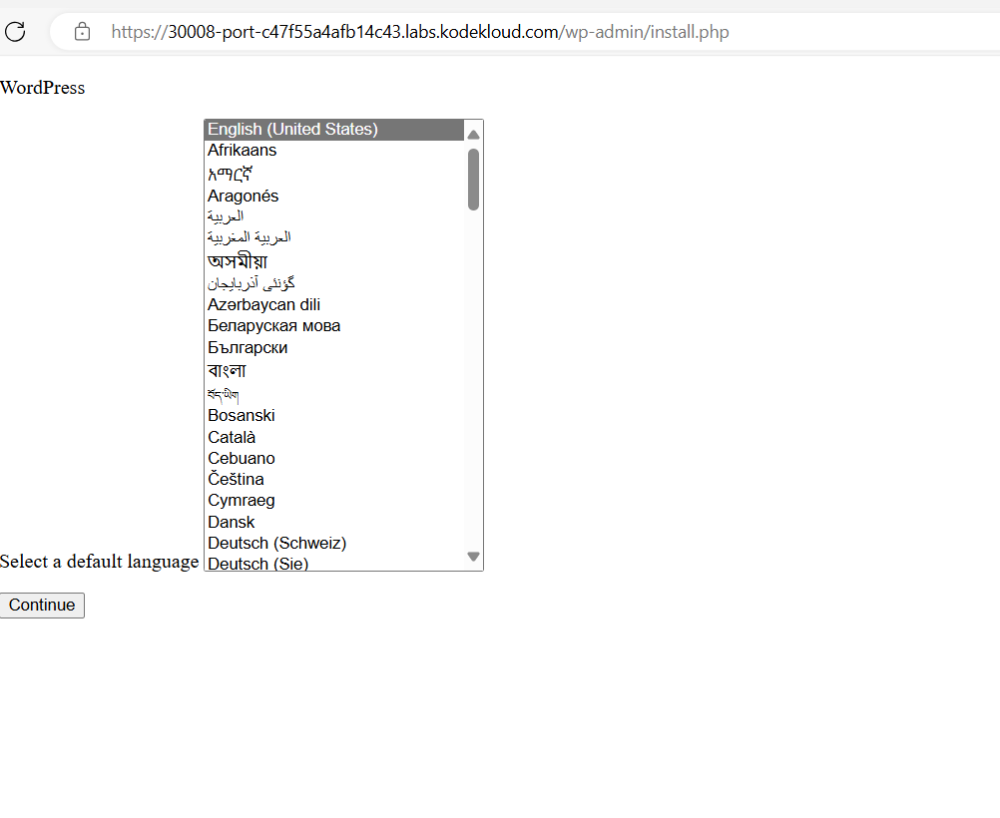
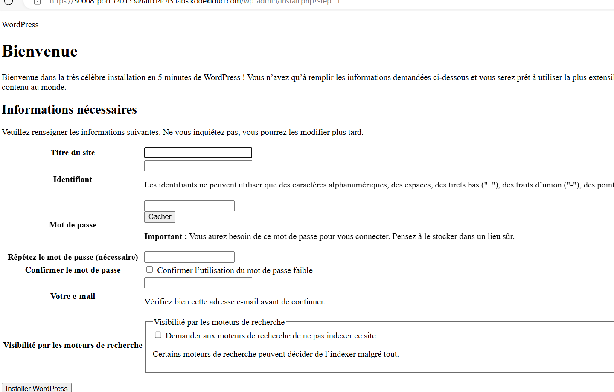

# Projet de déploiement de WordPress avec Kubernetes

Ce projet vise à déployer WordPress en utilisant Kubernetes. Il utilise des déploiements, des services et des volumes pour créer une application WordPress fonctionnelle avec une base de données MySQL.

## Prérequis

Avant de commencer, assurez-vous d'avoir les éléments suivants :

- Un cluster Kubernetes ou Minikube fonctionnel
- L'outil `kubectl` configuré pour se connecter au cluster

## Instructions

Suivez les étapes ci-dessous pour déployer WordPress avec Kubernetes :

1. Créez un namespace :
   - Utilisez le fichier yml fourni (`app-wordpress-namespace.yml`) pour créer un namespace spécifique pour ce projet en exécutant la commande suivante : `kubectl apply -f app-wordpress-namespace.yml`

2. Déployez MySQL :
   - Utilisez le fichier yml fourni (`mysql-deployment.yml`) pour déployer MySQL en exécutant la commande suivante : `kubectl apply -f mysql-deployment.yml`

3. Créez un service pour MySQL :
   - Utilisez le fichier yml fourni (`service-clusterip-mysql.yml`) pour créer un service ClusterIP pour exposer les pods MySQL en exécutant la commande suivante : `kubectl apply -f service-clusterip-mysql.yml`

4. Déployez WordPress :
   - Utilisez le fichier yml fourni (`wordpress-deployment.yml`) pour déployer WordPress en exécutant la commande suivante : `kubectl apply -f wordpress-deployment.yml`

5. Créez un service pour WordPress :
   - Utilisez le fichier yml fourni (`service-nodeport-wordpress.yml`) pour créer un service NodePort pour exposer le frontend de WordPress en exécutant la commande suivante : `kubectl apply -f service-nodeport-wordpress.yml`

6. Accédez à WordPress :
   - Utilisez la commande `hostname -I` pour obtenir l'adresse IP de votre cluster.
   - Ouvrez un navigateur web et accédez à l'adresse IP du cluster avec le NodePort spécifié pour le service WordPress dans le fichier `service-nodeport-wordpress.yml`.
     

   
   

## Architecture du projet

- `app-wordpress-namespace.yml` : Fichier yml pour la création d'un namespace spécifique pour le projet.
- `mysql-deployment.yml` : Fichier yml pour le déploiement de MySQL.
- `service-clusterip-mysql.yml` : Fichier yml pour la création d'un service ClusterIP pour MySQL.
- `wordpress-deployment.yml` : Fichier yml pour le déploiement de WordPress.
- `service-nodeport-wordpress.yml` : Fichier yml pour la création d'un service NodePort pour WordPress.

## Remarques

- Assurez-vous que votre cluster Kubernetes ou Minikube est configuré correctement avant de commencer le déploiement.
- Vous pouvez personnaliser les valeurs, les variables d'environnement et les options de volumes selon vos besoins dans les fichiers de déploiement yml.
  
